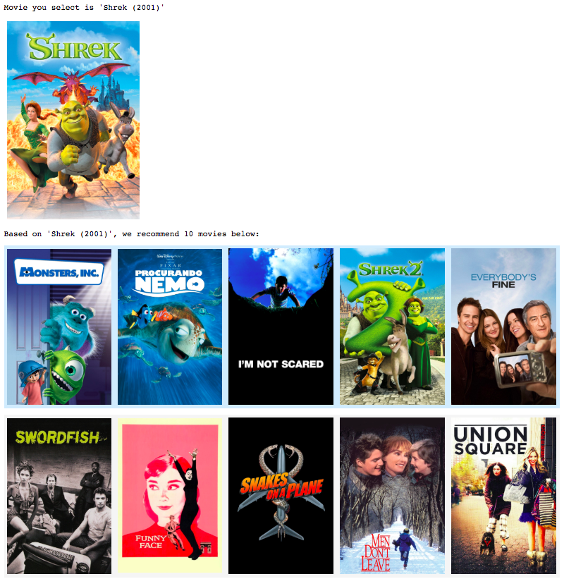
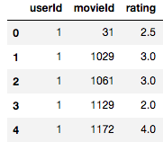
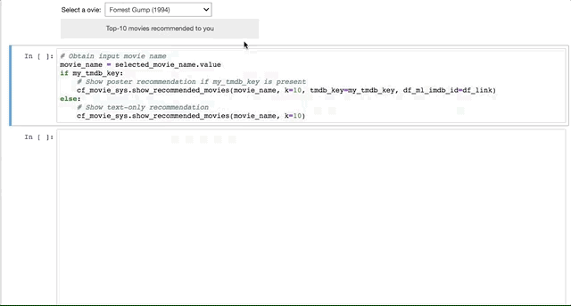

# Collaborative Filtering Recommender System

In this project, we utilize model-based collaborative filtering and [MovieLens](https://grouplens.org/datasets/movielens/) dataset to build a prototype movie recommender system.  You, as a new user, can select one favorite movie from the drop-down menu  and then 10 movies will be recommended to you base on previous users' experience. Such interactive user interface is implemented on Jupyter notebook.

 

### Collaborative filtering

Collaborative filtering (CF), one classical approach in recommender system, is based on the past user behavior to rate or purchase items. CF basically analyzes the similarity of item preference of users. It does not depend on the item details but is only focused on extracting meaningful collaborative behavior. This makes CF a general framework and ready to be applied products, like books, music, news articles, etc.

There are three basic types of CF:

1. User-based collaborative filtering
2. Item-based collaborative filtering
3. Model-based collaborative filtering

The first two are usually called memory-based CF and rely on computing user-to-user and item-to-item similarity. In this project, we use model-based CF, which is more tied to the core of machine learning. 

### Model-based CF & matrix factorization

The dataset in recommender system usually describes the behavior of M users on N items. Below is an example to record how each user (userId) rates certain movie (movieId).

Mathematically, this table can be converted to a big M x N matrix with element value equal to rating. Since the items every user can afford to rate/purchase/browse are much less than N, this behavior can be written down a sparse matrix, where majority of elements are zero. Assuming there is a hidden structure governing the user-item behavior, it means we can project  this matrix to a lower dimension that dictates such hidden structure. The low dimensionality k can be interpreted as certain tastes shared by groups of users. To put this into mathematical language, we want o factorize M x N matrix to one M x k and one k x N matrices, which represent a user feature matrix and an item feature matrix respectively.

Luckily, there a handy package [Surprise](https://surprise.readthedocs.io/en/stable/) for everyone to build a simple recommender system without diving into mathematical nightmare. Here, we build a simple interface for you to feed in a table like the one above and enjoy what movies are recommend to you.

## Usage

Download this project and  [MovieLens](https://grouplens.org/datasets/movielens/) dataset ([ml-latest-small.zip](http://files.grouplens.org/datasets/movielens/ml-latest-small.zip) will be a good starting point). Open  CFRecommenderSystem.ipynb. If you like to have a fancy posters shown in your Jupyter notebook, get an API key from [TMDB](https://www.themoviedb.org/documentation/api) and assign it to *my_tmdb_key* variable in our notebook.

## Requirement:

Please make sure  the packages below are installed:

-  [Surprise](https://surprise.readthedocs.io/en/stable/)
- Numpy, Pandas
- Matplotlib, seaborn
- ipywidgets and IPython

## Installation

Download this project and follow CFRecommenderSystem.ipynb as an example.